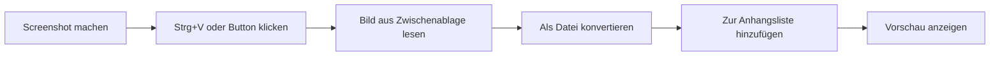

# Screenshot aus Zwischenablage einfügen

## Übersicht

Ein neuer "Screenshot einfügen" Button wird beim Datei-Upload hinzugefügt, mit dem Screenshots direkt aus der Zwischenablage als Anhang eingefügt werden können.

---

## Funktionsweise

---

## Features

### Screenshot-Button
- Neuer Button **"Screenshot einfügen"** neben dem Datei-Upload-Bereich
- Kamera/Clipboard-Icon zur Kennzeichnung
- Klick öffnet die Zwischenablage und fügt das Bild ein

### Automatisches Einfügen mit Strg+V
- Im gesamten Upload-Bereich kann mit **Strg+V** ein Screenshot eingefügt werden
- Funktioniert auch ohne den Button zu klicken

### Dateiname
- Automatisch generiert: `Screenshot_2024-01-15_14-30-45.png`
- Enthält Datum und Uhrzeit für eindeutige Benennung

### Vorschau
- Eingefügte Screenshots werden sofort als Vorschaubild angezeigt
- Wie bei anderen Bild-Anhängen

---

## Einschränkungen

- Nur Bilder können eingefügt werden (PNG, JPEG)
- Maximale Dateigröße: 2 MB (wie bei normalen Uploads)
- Maximale Anzahl Dateien: 5 (wie bei normalen Uploads)
- Browser muss Clipboard API unterstützen (alle modernen Browser)

---

## Betroffene Bereiche

- Neue Bestellung erstellen
- Bestellung bearbeiten (falls vorhanden)
