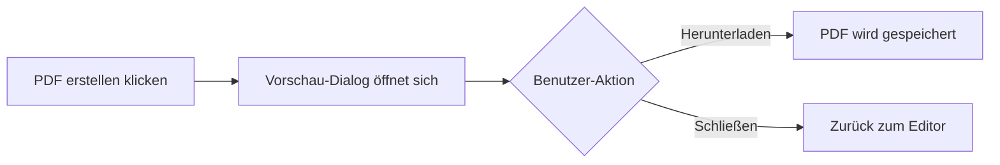

# Übungsplan-Generator: PDF-Vorschau, UI-Verbesserungen & Zugriffsverwaltung

## Übersicht

Dieser Plan umfasst mehrere Verbesserungen am Übungsplan-Generator:

---

## 1. PDF-Export mit Vorschau

**Aktuell:** Das PDF wird direkt heruntergeladen ohne Vorschau.

**Neu:** Nach Klick auf "PDF erstellen" öffnet sich eine Vollbild-Vorschau:

**Features:**
- Vollbild-Vorschau des generierten PDFs
- Download-Button zum Speichern
- Schließen-Button zum Zurückkehren
- Zoom-Funktionen für bessere Lesbarkeit

---

## 2. PDF-Kopfzeile anpassen

**Änderungen:**
- Titel "Übungsplan" größer darstellen (aktuell 32px → neu 40px)
- Jahreszahl aus der Überschrift entfernen
- Von-Bis Datum deutlich unter dem Titel anzeigen
- Überflüssiger Text unter dem Logo wird entfernt

**Vorher → Nachher:**
| Element | Vorher | Nachher |
|---------|--------|---------|
| Titel | Übungsplan 2025 | Übungsplan |
| Titelgröße | 32px | 40px |
| Datum | Klein unter Titel | Deutlich sichtbar: "01. Jänner - 31. März 2025" |

---

## 3. Kategorien-Dropdown verbessern

**Aktuelle Probleme:**
- Horizontales Scrollen möglich
- Breite nicht automatisch angepasst

**Verbesserungen:**
- Dropdown passt sich automatisch an die Inhaltsbreite an
- Kein horizontales Scrollen mehr
- Mehrfachauswahl bleibt erhalten (Checkboxen)
- Ausgewählte Kategorien werden als farbige Chips angezeigt

---

## 4. Zugriffsverwaltung sichtbar machen

**Aktueller Stand:** Die Zugriffsverwaltung existiert unter:
> Einstellungen → Benutzer und Rechte → Zugriffsrechte

Dort gibt es bereits einen Eintrag "Übungsplan-Generator".

**Problem:** Der Eintrag ist möglicherweise nicht sichtbar oder nicht aktiv.

**Lösung:** 
- Prüfen ob der Übungsplan-Eintrag korrekt angezeigt wird
- Sicherstellen, dass die Berechtigungsstufen (Kein Zugriff / Lesen / Bearbeiten / Admin) funktionieren

---

## Zusammenfassung der Änderungen

| Bereich | Änderung |
|---------|----------|
| PDF-Export | Vorschau-Dialog mit Download-Button |
| PDF-Titel | Größer, ohne Jahr |
| PDF-Datum | Von-Bis Datum deutlich sichtbar |
| Kategorien | Dropdown-Breite automatisch |
| Zugriff | Eintrag in Zugriffsrechte prüfen |

---

## Hinweis zum Logo-Text

Ich benötige noch eine Klärung: Welcher Text genau soll unter dem Logo entfernt werden? Aktuell steht links der Titel "Übungsplan" und rechts das Logo. Falls du einen anderen Text meinst, zeig mir gerne einen Screenshot.